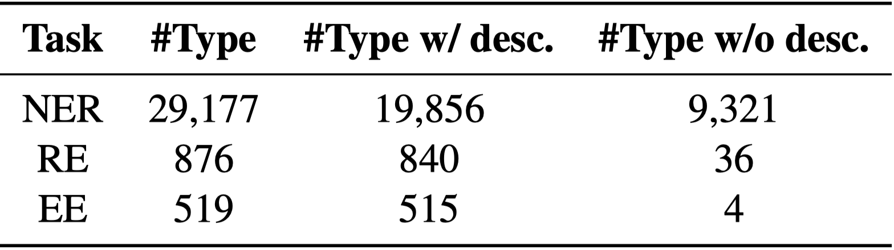
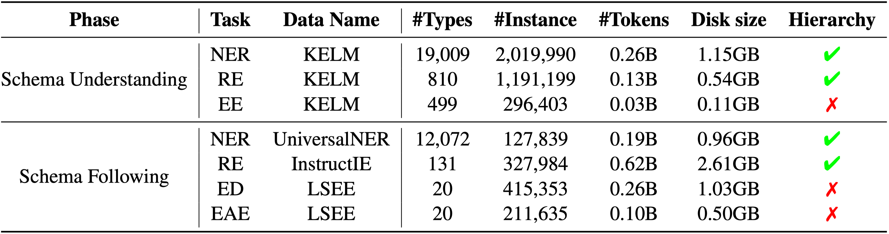
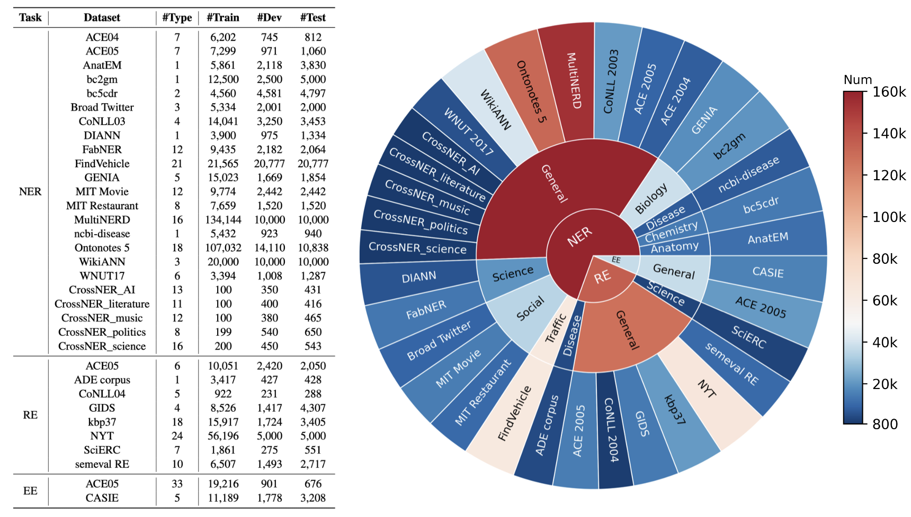
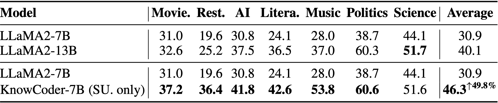
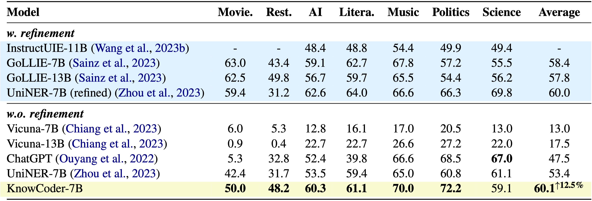
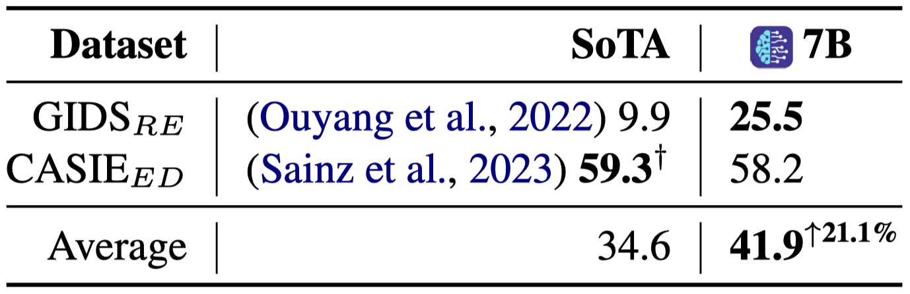
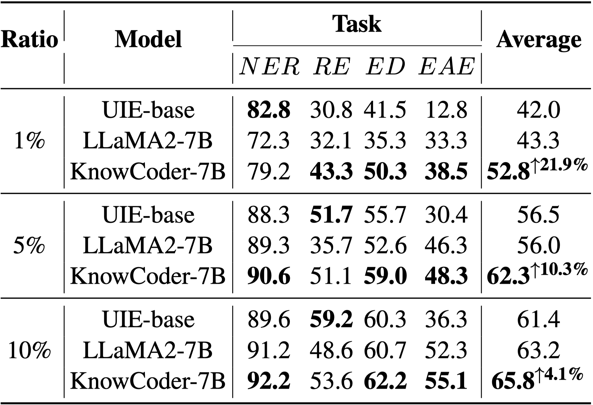
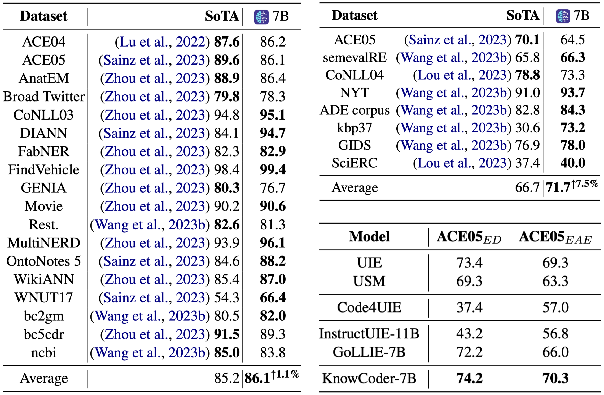

<p align="center">
   
</p>

<h1 align="center"> KnowCoder: Coding Structured Knowledge into LLMs for Universal
Information Extraction </h1>

<p align="center">
<a href="https://arxiv.org/abs/2403.07969">📃 Paper</a>
|
<a href="https://huggingface.co/collections/ICT-GoKnow/knowcoder-65f2a9592b802e8713203471" >🤗 Resource (Schema • Data • Model)</a>
|
<a href="https://ict-goknow.github.io/knowcoder/">🚀 Try KnowCoder (coming soon)!</a>
</p>


# 🔍 Overview

<p align="justify">
We released  KnowCoder, a powerful Large Language Model for Universal Information Extraction that injects <b>thousands of structured knowledge</b> through code. KnowCoder is capable of concurrently extracting close to <b>29,000</b> types of entities, over <b>500</b> types of relationships, and more than <b>500</b> types of events from a given sentence!
</p>

To comprehensively assess its efficacy, we conducted various and comprehensive evaluations across **33** widely recognized information extraction benchmarks:

- After code pretraining on around **1.5**B automatically constructed data, KnowCoder already attains remarkable generalization ability and achieves NER improvements compared to LLaMA2 by **49.8**% relative F1 under the **few-shot setting**.

- After instruction tuning, KnowCoder further exhibits strong generalization ability on unseen schemas and achieves up to **12.5**% and **21.9**% under the **zero-shot setting** and the **low resource setting**, respectively.

- Additionally, based on our unified schema representations, various human-annotated datasets can simultaneously be utilized to refine KnowCoder, which achieves significant improvements up to **7.5**% under the **supervised setting**.


# 🎉 News
- 📚[**2024-03-19**]: We have open-sourced the datasets used in KnowCoder, i.e. KnowCoder Dataset.
- 🏷️[**2024-03-19**]: We have open-sourced the code-style Schema Library covering over 30,000 types of knowledge, i.e. KnowCoder Schema.
- 🔥[**2024-03-19**]: We have open-sourced the initial version of  KnowCoder series! We extend a warm invitation to everyone to experience our models and eagerly anticipate your active engagement!


# 🏷️ KnowCoder Schema

We construct the code-style schema library based on Wikidata (Note that we use the Wikidata dump up to 20220704) with the **schema representation method** blow.

<p align="center">
   
</p>

The code-style schema representation method comprises three basic classes, namely, "Entity", "Relation", and "Event". Based on the three basic classes, we represent all the concepts in the schemas by the corresponding classes. Thus, the instances of each concept can be represented by the objects of the corresponding class. A schema consists of the class name, class inheritance, class comments, type hint, and class method. **Please refer to the paper for more details.**

We select the concepts included in the existing IE datasets created from Wikidata, i.e., [KELM](https://github.com/google-research-datasets/KELM-corpus), [UniversalNER](https://huggingface.co/Universal-NER), [InstructIE](https://huggingface.co/datasets/zjunlp/InstructIE), and [LSEE](https://github.com/acl2017submission/event-data), and derive the constraints among concepts according to their co-occurrences. To construct the taxonomies, we extract the "subclass of" relations among these concepts from Wikidata. To obtain the description of a concept, we use its definition from Wikidata directly or generate its descriptions using GPT-4 if its definition in Wikidata is missing. Finally, the constructed schema library encompasses over 29,177 entity types, 876 relation types, and 519 event types. The detailed statistics of the schema are shown in the following table.

<p align="center">
   
</p>

*"\#Type" indicates the total number of types; "\#Type w/ desc." indicates the count of types with descriptions; "\#Type w/o desc." indicates the count of types without descriptions.*


# 📚 KnowCoder Dataset

KnowCoder Dataset consists of three parts: schema understanding data, schema following data, and specific domain IE data, which is released in [🤗KnowCoder](https://huggingface.co/collections/ICT-GoKnow/knowcoder-65f2a9592b802e8713203471).

### 1. Schema Understanding Data

The schema understanding data includes schema definition codes and schema instance codes, which is released in [🤗Schema-Understanding-Data](https://huggingface.co/datasets/ICT-GoKnow/Schema-Understanding-Data). The schema definition codes are constructed based on the KnowCoder Schema, and the schema instance codes are constructed based on [KELM](https://github.com/google-research-datasets/KELM-corpus).

The cases of schema understanding data are shown [here](Cases.md).

### 2. Schema Following Data

The schema following data is constructed on [UniversalNER](https://huggingface.co/Universal-NER), [InstructIE](https://huggingface.co/datasets/zjunlp/InstructIE), and [LSEE](https://github.com/acl2017submission/event-data), which is released in [🤗Schema-Following-Data](https://huggingface.co/datasets/ICT-GoKnow/Schema-Following-Data).

The cases of schema following data are shown [here](Cases.md).

It is worth noting that, schema understanding data and schema following data are large-scale data sets constructed by our automated methods. The detailed statistics of the dataset are shown in the following table.

<p align="center">
   
</p>

### 3. Specific Domain IE Data

**Note:** *Because some data sets have copyright requirements and need licenses, we cannot directly release this part of the data now. If you have a license for restricted datasets, you can use them to contact emails in Contact to obtain data.*

For specific domain Information Extraction (IE), we conduct experiments utilizing 33 datasets, comprising 23 datasets for the NER task, 8 datasets for the RE task, and 2 datasets for the ED and EAE tasks. Here is the overview of the datasets on specific domain IE by task and size. **Please refer to the paper for more details of the setting of each dataset.**

<p align="center">
   
</p>

*"\#Type" indicates the number of types; "\#Train", "\#Dev", and "\#Test" indicate the number of sentences in the training, development, and testing datasets, respectively.*


#  KnowCoder Model

After two phases of training (i.e. Schema Understanding Phase and Schema Following Phase) on KnowCoder Dataset, KnowCoder has the powerful general information extraction ability under Zero-shot, Few-shot, Low-resource, and Supervised settings. 

We release two variants of KnowCoder, the base version trained in two phases and the IE version further refined with Specific Domain IE Data on the base version:
- [KnowCoder-7b-base](https://huggingface.co/ICT-GoKnow/KnowCoder-7B-base): using Llama-2-7b as the backbone with 4k context window.
- [KnowCoder-7b-IE](https://huggingface.co/ICT-GoKnow/KnowCoder-7B-IE): using Llama-2-7b as the backbone with 4k context window.


# 💥 Performance
### 1. Results under few-shot setting
We conduct few-shot experiments on four IE tasks after the schema understanding phase.

<p align="center">

</p>


### 2. Results under zero-shot setting
To verify the generalization ability of KnowCoder, we conduct zero-shot experiments on 9 datasets across NER, RE, and ED tasks.

**Results on NER**

<p align="center">

</p>

**Results on RE, ED**

<p align="center">

</p>


### 3. Results under low-resource setting
To further investigate the generalization ability of KnowCoder (without refinement) for IE tasks, we conduct low-resource experiments on three different partitions of the original training sets (1/5/10% ratio) across four tasks.

<p align="center">

</p>


### 4. Results under supervised setting
We conduct supervised experiments on four IE tasks, including NER, RE, ED, and EAE. 

<p align="center">

</p>


# 📊 KnowCoder Benchmark

**Note:** *Because some data sets have copyright requirements and need licenses, we cannot directly release the KnowCoder Benchmark now. If you have a license for restricted datasets, you can use them to contact emails in Contact to obtain data.*

**Coming soon!**


# ⚡️ Quickstart

**Coming soon!**


# 🚀 Demo
<video src="https://github.com/ICT-GoKnow/KnowCoder/assets/115405099/7c0c3ec0-2b2c-46ed-8ec2-b215bac1bbf7"> </video>

*Demo of the chat interface. KnowCoder not only demonstrated strong strength in English information extraction across thousands of given knowledge types, while also delivering commendable results in Chinese information extraction, facilitated by our Schema Representation Method.*


# :warning: Limitations

The KnowCoder model still has the following issues due to the current training
data and used foundational models:

- The structured knowledge extracted may be contrary to facts in the real world. 
- It cannot adequately identify hazardous instructions, which may lead to
harmful extraction results. 
- Its extraction capability for scenarios involving paragraph-level long
texts still needs improvement. 
- KnowCoder, being trained in English-language corpora, possesses the capability
to extract knowledge across various languages. However, its effectiveness in
non-English contexts is not assured.


# :copyright: Protocols
- The open-sourced code, data, models, and any derivatives emanating from this
project be exclusively utilized for research purposes. 
- They are strictly prohibited from being used for commercial purposes or any
activities that could potentially inflict harm upon society. 
- Users are urged to exercise due diligence and responsibly handle the content
generated by KnowCoder, refraining from disseminating any harmful content
online. 
- The disseminator will be held accountable for any negative repercussions
that may arise. 
- The project developers disclaim any liability for damages or losses incurred
as a result of utilizing this project's resources (including, but not limited
to, data, models, code, etc.). 
- For more detailed information, please consult the project's email.


# ✅ Open Source License
The code and data in this project are open-sourced under the Apache-2.0 license.
Community use of KnowCoder or its derivatives should follow the LLaMA2 community
protocol and commercial agreement.


# 📌 Citation

If you find the repository or paper helpful, please cite our work:

```
@article{li2024knowcoder,
  title={KnowCoder: Coding Structured Knowledge into LLMs for Universal Information Extraction},
  author={Li, Zixuan and Zeng, Yutao and Zuo, Yuxin and Ren, Weicheng and Liu, Wenxuan and Su, Miao and Guo, Yucan and Liu, Yantao and Li, Xiang and Hu, Zhilei and others},
  journal={arXiv preprint arXiv:2403.07969},
  year={2024}
}
```


# :email: Contact

If you have any questions or feedback, please feel free to reach out via email at truman.yx.zuo@gmail.com, lizixuan@ict.ac.cn.
